# Customer Churn Prediction & Analytics Platform

[](https://www.python.org/)
[](https://fastapi.tiangolo.com/)
[](https://streamlit.io/)
[](https://www.docker.com/)
[](https://scikit-learn.org/)
[](https://telco-churn-dashboard-c8rg.onrender.com/)

An end-to-end machine learning system that predicts customer churn for a telecom business, exposes predictions via a production-style **REST API**, and visualizes insights through an interactive **analytics dashboard**. Built to mirror how ML solutions are actually shipped — from raw data to a containerized, deployable service.

### 🔗 Live Demo

| | |
|---|---|
| 📊 **Dashboard** | [telco-churn-dashboard-c8rg.onrender.com](https://telco-churn-dashboard-c8rg.onrender.com/) |
| ⚙️ **API (Swagger docs)** | [telco-churn-api-54s6.onrender.com/docs](https://telco-churn-api-54s6.onrender.com/docs) |

> Hosted on Render's free tier — the app may take 30–60 seconds to spin up on first load if it's been idle.

<!-- Optional: add a banner/GIF here of the dashboard in action -->
<!--  -->

---

## 🎯 Business Problem

Customer churn costs telecom companies significantly more in acquiring new customers than retaining existing ones. This project builds a predictive system that identifies **which customers are likely to churn and why**, enabling targeted retention campaigns before revenue is lost.

**Impact:** The final model correctly flags **50% of customers who go on to churn** (recall) with **65% precision** on those flagged, at a **0.83 ROC-AUC** — giving retention teams a ranked, actionable risk list instead of guessing who to target.

---

## 📊 Key Results

| Metric | Score |
|---|---|
| Model | Gradient Boosting Classifier (best performer, selected for deployment) |
| Accuracy | 76.1% |
| ROC-AUC | 0.828 (0.813 ± 0.015 via 5-fold CV) |
| Precision (churn class) | 0.65 |
| Recall (churn class) | 0.50 |
| F1-Score (churn class) | 0.57 |

Benchmarked against three alternative models on a held-out test set (n=1,000):

| Model | Accuracy | ROC-AUC | Precision | Recall | F1 |
|---|---|---|---|---|---|
| **Gradient Boosting** ⭐ | **76.1%** | **0.828** | 0.65 | 0.50 | **0.57** |
| Logistic Regression | 75.9% | 0.818 | 0.65 | 0.51 | 0.57 |
| Random Forest | 75.7% | 0.816 | **0.66** | 0.46 | 0.54 |
| Decision Tree | 74.3% | 0.787 | 0.61 | 0.48 | 0.54 |

Gradient Boosting was selected for deployment based on the highest ROC-AUC and strongest balance of precision/recall on the minority (churn) class, validated with 5-fold cross-validation (ROC-AUC: 0.813 ± 0.015) to confirm the result wasn't a lucky train/test split.

> Full evaluation, confusion matrices, and feature importance charts are in [`outputs/`](outputs/).

**Top churn drivers identified:** <!-- FILL IN, e.g. "Contract type, tenure, monthly charges, and tech support usage" -->

### 📊 Exploratory Data Analysis

<table>
<tr>
<td width="33%">

**Churn Distribution**
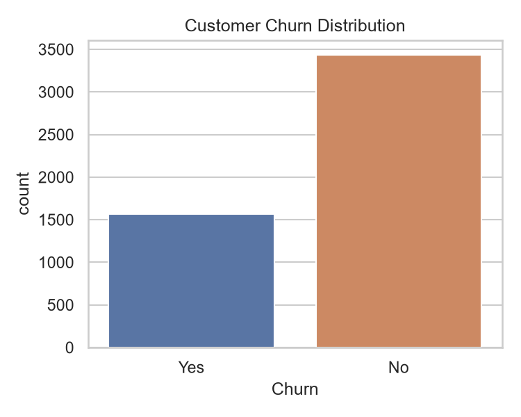

</td>
<td width="33%">

**Churn by Contract Type**
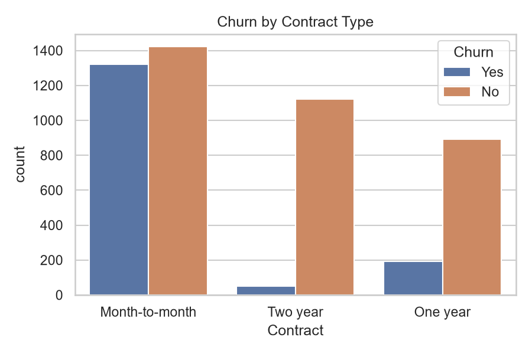

</td>
<td width="33%">

**Monthly Charges by Churn**
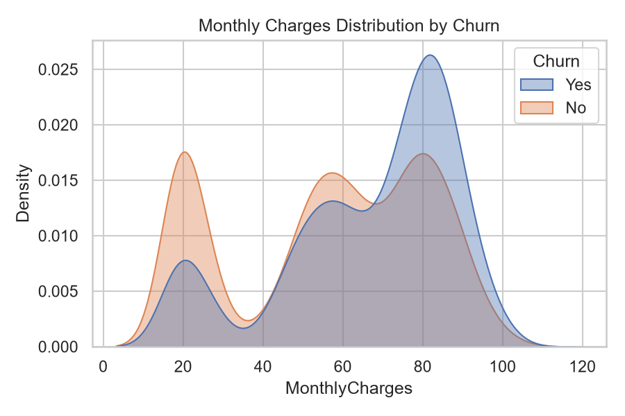

</td>
</tr>
<tr>
<td width="33%">

**Tenure by Churn**
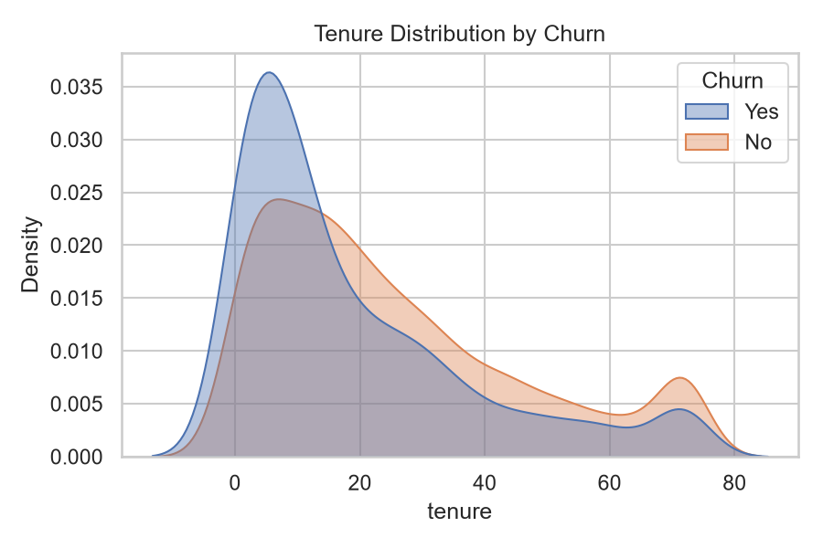

</td>
<td width="33%">

**Churn by Internet Service**
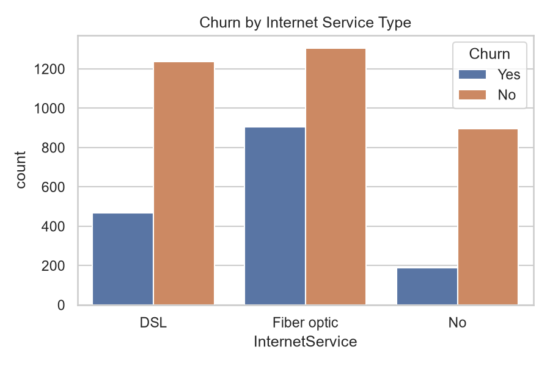

</td>
<td width="33%">

**Feature Correlation Heatmap**
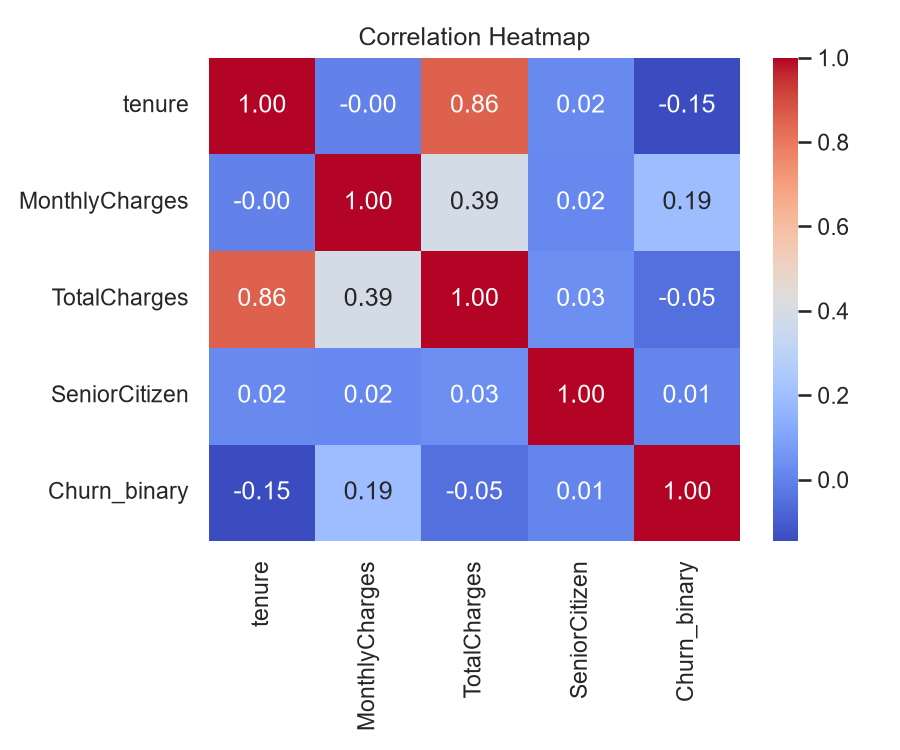

</td>
</tr>
<tr>
<td width="33%">

**Churn by Payment Method**
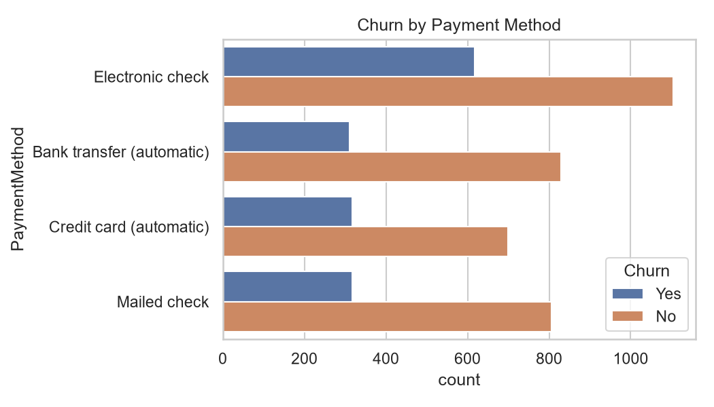

</td>
<td colspan="2"></td>
</tr>
</table>

### 🤖 Model Results

<table>
<tr>
<td width="33%">

**Model Comparison**
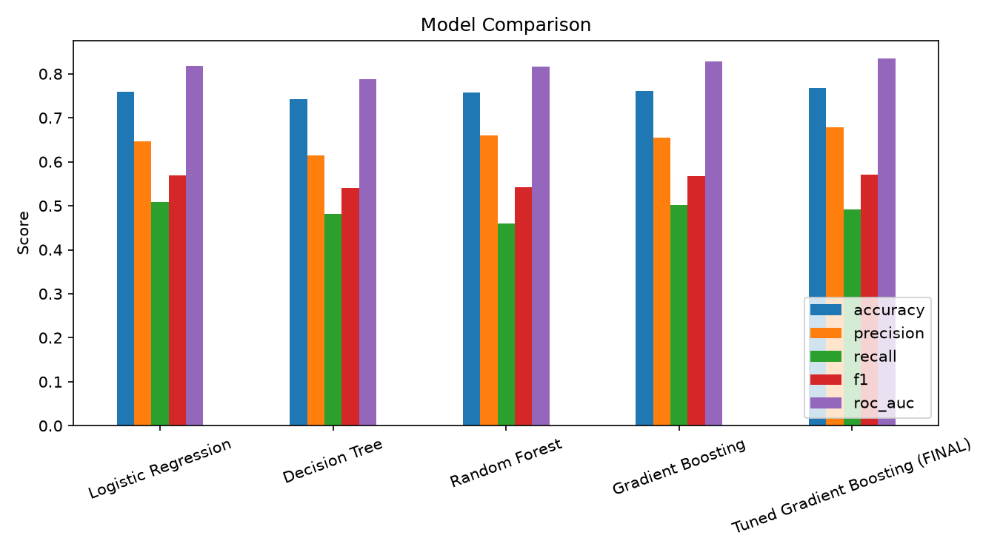

</td>
<td width="33%">

**ROC Curve**
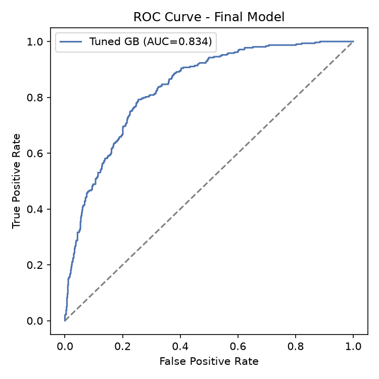

</td>
<td width="33%">

**Confusion Matrix**
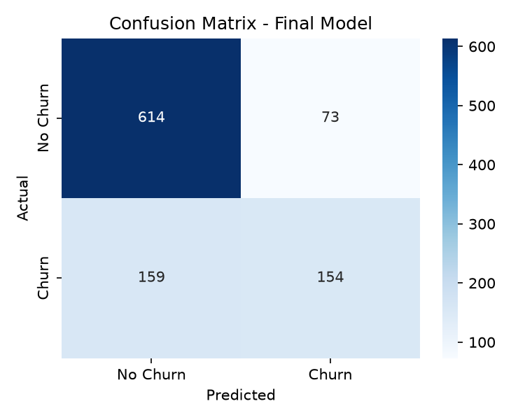

</td>
</tr>
<tr>
<td width="33%">

**Feature Importance**
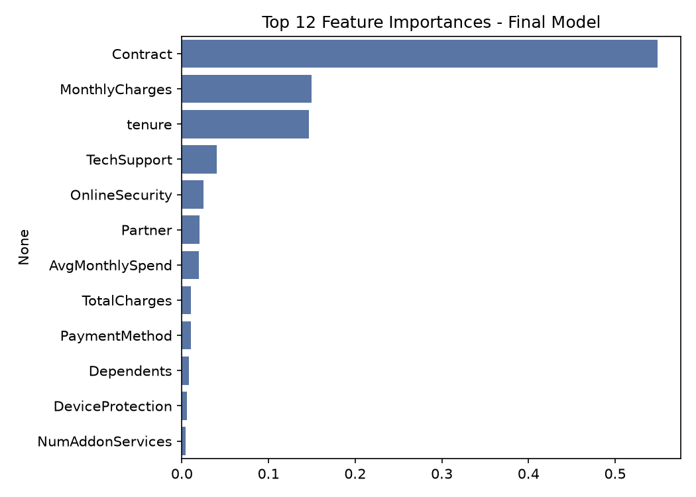

</td>
<td colspan="2"></td>
</tr>
</table>

---

## 🏗️ Architecture

```
Raw Data → Preprocessing & Feature Engineering → Model Training & Tuning
                                                          ↓
                                          Serialized Model (joblib)
                                                          ↓
                        ┌─────────────────────────────────┴─────────────────────────────────┐
                        ↓                                                                     ↓
                FastAPI REST Service                                          Streamlit Dashboard
                (real-time predictions)                                    (interactive exploration)
                        └──────────────────────────┬──────────────────────────────────────────┘
                                                     ↓
                                          Docker Compose (orchestration)
```

---

## 🛠️ Tech Stack

- **Language:** Python 3.10+
- **Data Processing:** Pandas, NumPy
- **Machine Learning:** scikit-learn (Gradient Boosting), feature engineering, hyperparameter tuning, label encoding, feature scaling
- **API:** FastAPI, Pydantic, Uvicorn
- **Dashboard / Visualization:** Streamlit, Matplotlib/Seaborn/Plotly
- **Model Persistence:** Joblib
- **Containerization & Deployment:** Docker, Docker Compose
- **Version Control:** Git/GitHub

---

## 📁 Project Structure

```
churn_project/
├── data/
│   ├── generate_data.py          # synthetic Telco-style dataset generator
│   ├── telco_churn.csv           # raw dataset
│   └── telco_churn_processed.csv # cleaned + feature-engineered dataset
├── notebooks/
│   ├── eda.py                    # exploratory data analysis
│   ├── preprocess.py             # cleaning + feature engineering
│   ├── train_models.py           # model training, tuning, evaluation
│   └── test_predict.py           # sanity-check script for the model
├── models/
│   ├── churn_model.joblib        # final tuned Gradient Boosting model
│   ├── label_encoders.joblib
│   ├── scaler.joblib
│   └── feature_columns.joblib
├── app/
│   ├── main.py                   # FastAPI prediction service
│   ├── dashboard.py               # Streamlit dashboard
│   └── requirements.txt
├── outputs/                       # all charts generated for the report
├── Dockerfile                     # containerizes the API
├── Dockerfile.dashboard           # containerizes the dashboard
└── docker-compose.yml             # runs both services together
```

---

## 🚀 Getting Started

### Prerequisites
- Python 3.10+
- Docker & Docker Compose (for containerized run)

### Option 1: Run with Docker (recommended)

```bash
git clone https://github.com/<your-username>/churn_project.git
cd churn_project
docker-compose up --build
```

- API available at: `http://localhost:8000`
- Dashboard available at: `http://localhost:8501`

### Option 2: Run locally

```bash
# Clone and set up environment
git clone https://github.com/<your-username>/churn_project.git
cd churn_project
python -m venv venv
source venv/bin/activate  # Windows: venv\Scripts\activate
pip install -r app/requirements.txt

# Generate / preprocess data (optional — pre-generated CSVs are included)
python data/generate_data.py
python notebooks/preprocess.py

# Train the model
python notebooks/train_models.py

# Run the API
uvicorn app.main:app --reload

# Run the dashboard (in a separate terminal)
streamlit run app/dashboard.py
```

---

## 🔌 API Usage

**Endpoint:** `POST /predict`

```bash
curl -X POST "http://localhost:8000/predict" \
  -H "Content-Type: application/json" \
  -d '{
    "tenure": 12,
    "MonthlyCharges": 70.5,
    "Contract": "Month-to-month",
    "InternetService": "Fiber optic"
  }'
```

**Response:**
```json
{
  "churn_prediction": "Yes",
  "churn_probability": 0.78
}
```

Interactive API docs (Swagger UI) available at `http://localhost:8000/docs` once the service is running.

---

## 📈 Dashboard

The Streamlit dashboard provides:
- Real-time churn risk scoring for individual customers
- Cohort-level churn trends by contract type, tenure, and service usage
- Feature importance and model explainability visuals

<!-- Optional:  -->

---

## 🧠 Methodology

1. **Data Generation/Ingestion** — synthetic Telco-style dataset mirroring real-world churn patterns
2. **EDA** — distribution analysis, correlation checks, class imbalance review
3. **Feature Engineering** — encoding categorical variables, scaling numeric features, derived features (e.g., tenure buckets, charge ratios)
4. **Model Selection** — benchmarked four classifiers (Logistic Regression, Decision Tree, Random Forest, Gradient Boosting) on identical train/test splits
5. **Hyperparameter Tuning** — tuned the top-performing model (Gradient Boosting) and validated stability with 5-fold cross-validation
6. **Evaluation** — accuracy, ROC-AUC, precision/recall, confusion matrix, feature importance
7. **Deployment** — model served via FastAPI, containerized with Docker for reproducible deployment

---

## 🔮 Future Improvements

- [ ] CI/CD pipeline for automated testing and deployment
- [ ] Model monitoring for data/concept drift
- [ ] A/B testing framework for retention campaign effectiveness
- [ ] Cloud deployment (AWS/GCP/Azure)
- [ ] Integration with a live CRM data source

---

## 👤 Author

Mahak Rathee 

LinkedIn: www.linkedin.com/in/mahak-rathee | Email: mahakrathee967@gmail.com
